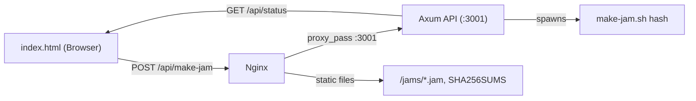

# nockchain-jammer


Make yummy jams. Serves Nockchain state jam binaries with SHA-256 checksum verification, and provides an API to trigger new jam builds from the website.

## Components

| File / Dir | Purpose |
|------------|---------|
| `website/` | Frontend — html, icons, and static assets |
| `make-jam.sh` | Stops the nockchain service, hashes `.jam` files, writes `SHA256SUMS`, restarts service |
| `api/` | Axum (Rust) API server that runs `make-jam.sh` on demand |

## API Endpoints

| Method | Path | Auth | Description |
|--------|------|------|-------------|
| `POST` | `/api/make-jam` | `X-API-Key` header | Run `make-jam.sh hash` and return output |
| `GET`  | `/api/status` | none | Check if a job is currently running |

## Architecture



## Front-End


## Quick Install

Run this one-liner on your server (requires root/sudo):

```bash
curl -fsSL https://raw.githubusercontent.com/your-repo/nockchain-jammer/main/install.sh | bash
```

**Before running, you can inspect the script:**
```bash
curl -fsSL https://raw.githubusercontent.com/your-repo/nockchain-jammer/main/install.sh
```

This automated installer will:
- ✅ Install all dependencies (Rust, nginx, build tools)
- ✅ Build and install the API binary from source
- ✅ Configure systemd service with auto-restart
- ✅ Set up nginx for both API proxy AND static website serving
- ✅ Configure proper permissions and sudo rules
- ✅ Generate a secure random API key
- ✅ Test the installation

After installation, you'll get a summary with your API key and usage instructions. The script is idempotent - you can run it multiple times safely.

## Manual Deployment

If you prefer to install manually or need more control:

### 1. Build the API binary

```bash
cd api
cargo build --release
```

The binary is at `api/target/release/nockchain-jammer-api`.

### 2. Install on the server

```bash
# Copy binary
scp api/target/release/nockchain-jammer-api server:/usr/local/bin/

# Copy the script
scp make-jam.sh server:/usr/local/bin/
chmod +x /usr/local/bin/make-jam.sh

# Copy the website (HTML + assets)
scp website/index.html server:/usr/share/nginx/html/jams/index.html
scp website/style.css server:/usr/share/nginx/html/jams/style.css
scp website/jam-icon.png server:/usr/share/nginx/html/jams/jam-icon.png
```

### 3. Set up the systemd service

```bash
# Copy the unit file
sudo cp api/nockchain-jammer-api.service /etc/systemd/system/

# Edit it to set your real API key
sudo systemctl edit --full nockchain-jammer-api
# Change API_KEY=CHANGE_ME to your secret key

# Enable and start
sudo systemctl daemon-reload
sudo systemctl enable --now nockchain-jammer-api

# Verify
systemctl status nockchain-jammer-api
```

### 4. Configure nginx

Add the reverse proxy block to your existing nginx server config (e.g. `/etc/nginx/sites-available/default`). The snippet is in `api/nginx-api.conf`:

```nginx
location /api/ {
    proxy_pass         http://127.0.0.1:3001;
    proxy_http_version 1.1;
    proxy_set_header   Host              $host;
    proxy_set_header   X-Real-IP         $remote_addr;
    proxy_set_header   X-Forwarded-For   $proxy_add_x_forwarded_for;
    proxy_set_header   X-Forwarded-Proto $scheme;
    proxy_read_timeout 120s;
    proxy_send_timeout 120s;
}
```

Then test and reload:

```bash
sudo nginx -t && sudo systemctl reload nginx
```

### 5. Permissions

`make-jam.sh` calls `systemctl stop/start nockchain`. The API service user needs permission to do this. Either:

- Run the API as root (simple but less secure), or
- Add a sudoers rule for the specific commands:

```bash
# /etc/sudoers.d/nockchain-jammer
jammer ALL=(ALL) NOPASSWD: /bin/systemctl stop nockchain, /bin/systemctl start nockchain, /bin/systemctl is-active nockchain
```

Then update `make-jam.sh` to use `sudo systemctl` instead of bare `systemctl`, or run the service as root.

## Environment Variables (API)

| Variable | Default | Description |
|----------|---------|-------------|
| `API_KEY` | *(empty — prints warning)* | Shared secret for `X-API-Key` header |
| `SCRIPT_PATH` | `/usr/local/bin/make-jam.sh` | Absolute path to the jam script |
| `JAMS_DIR` | `/usr/share/nginx/html/jams` | Directory containing `.jam` files (for status count) |

## Rate Limiting

Making jams is resource intensive so as an extra measure you should consider rate limiting. The rust code should prevent simultaneous runs but it's good to also have protection at the nginx layer.  

`/etc/nginx/nginx.conf`
```
http {

...

        # support API rate limiting 5 per minute
        limit_req_zone $binary_remote_addr zone=api_limit:10m rate=5r/m;
}
```

`/etc/nginx/sites-available/default`
```
    # nockchain-jammer API
    # Rate-limited: jam creation endpoint
    location = /api/make-jam {
        limit_req          zone=api_limit burst=3 nodelay;
        limit_req_status   429;

        proxy_pass         http://127.0.0.1:3001;
        proxy_http_version 1.1;
        proxy_set_header   Host              $host;
        proxy_set_header   X-Real-IP         $remote_addr;
        proxy_set_header   X-Forwarded-For   $proxy_add_x_forwarded_for;
        proxy_set_header   X-Forwarded-Proto $scheme;
        proxy_read_timeout 120s;
        proxy_send_timeout 120s;
    }
    # nockchain-jammer API
    # No rate limit: status polling and any future read-only endpoints
    location /api/ {
        proxy_pass         http://127.0.0.1:3001;
        proxy_http_version 1.1;
        proxy_set_header   Host              $host;
        proxy_set_header   X-Real-IP         $remote_addr;
        proxy_set_header   X-Forwarded-For   $proxy_add_x_forwarded_for;
        proxy_set_header   X-Forwarded-Proto $scheme;
    }
```

<a href="https://www.vecteezy.com/vector-art/49568465-strawberry-jam-illustration">Strawberry Jam Vector by Giuseppe Ramos</a>
