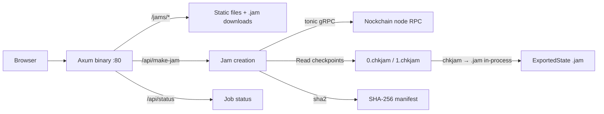

# nockchain-jammer


Make yummy state jams. 

A single binary serves the jam download website, provides an API to trigger new jam builds, manages the nockchain service lifecycle, and serves `.jam` files with SHA-256 checksum verification.

## Front-End


## Quick Install

```bash
curl -fsSL https://raw.githubusercontent.com/nocktoshi/nockchain-jammer/main/install.sh | bash
```

**Inspect before running:**
```bash
curl -fsSL https://raw.githubusercontent.com/nocktoshi/nockchain-jammer/main/install.sh
```

**Customize before installing:**
```bash
git clone https://github.com/nocktoshi/nockchain-jammer.git /opt/nockchain-jammer
cd /opt/nockchain-jammer
cp .env.example .env
# Edit .env with your settings (NOCKCHAIN_BIN, NOCKCHAIN_DIR, NOCKCHAIN_USER, etc.)
bash install.sh
```

The installer copies `.env` (or `.env.example`) to `/etc/nockchain-jammer.env` for the systemd service.

## Architecture

Export is done **from checkpoint files** while the nockchain node keeps running. The jammer reads `0.chkjam` and `1.chkjam` from `NOCKCHAIN_DIR/.data.nockchain/checkpoints/`, picks the newer by event number, decodes it, extracts kernel state (axis 6), and writes the same `.jam` format—without stopping the node or spawning a second nockchain process.



Everything runs in a single binary. No nginx, no shell scripts, no grpcurl.

## API Endpoints

| Method | Path | Auth | Description |
|--------|------|------|-------------|
| `POST` | `/api/make-jam` | `X-API-Key` header | Export a new state jam and update checksums |
| `GET`  | `/api/status` | none | Check if a job is currently running |

## Static Routes

| Path | Description |
|------|-------------|
| `/jams/` | Jam download website |
| `/jams/*.jam` | Jam binary downloads |
| `/jams/SHA256SUMS` | Checksum manifest |
| `/` | Redirects to `/jams/` |

## Environment Variables

`/etc/nockchain-jammer.env`

| Variable | Default | Description |
|----------|---------|-------------|
| `API_KEY` | *(empty)* | Shared secret for `X-API-Key` header |
| `API_PORT` | `3001` | Port to listen on |
| `JAMS_DIR` | `/usr/share/nginx/html/jams` | Directory for jam files and website assets |
| `HTML_ROOT` | `/usr/share/nginx/html` | Web root (for manifest relative paths) |
| `NOCKCHAIN_RPC` | `localhost:5556` | Nockchain gRPC endpoint |
| `NOCKCHAIN_BIN` | `/root/.cargo/bin/nockchain` | Path to nockchain binary |
| `NOCKCHAIN_DIR` | `/root/nockchain` | Nockchain repo/data directory; checkpoints are read from `NOCKCHAIN_DIR/.data.nockchain/checkpoints/` |
| `NOCKCHAIN_USER` | *(none)* | Unused (reserved for future use) |
| `NOCKCHAIN_SERVICE` | `nockchain` | Unused (reserved for future use) |

## Build Requirements

- Rust toolchain (installed automatically by `install.sh`). This project uses **nightly** (see `rust-toolchain.toml`) because the nockchain dependency requires it.
- `protobuf-compiler` (for gRPC proto generation)
- `build-essential`, `pkg-config`, `libssl-dev`

## Manual Build

```bash
cd api
cargo build --release
# Binary at api/target/release/nockchain-jammer-api
```


