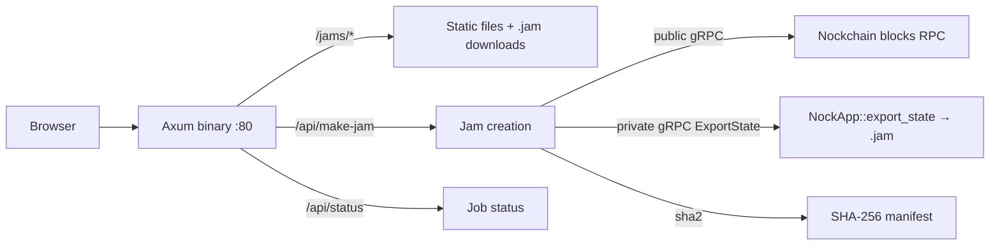

# nockchain-jammer


Make yummy state jams. 

A single binary serves the jam download website, provides an API to trigger new jam builds, and serves `.jam` files with SHA-256 checksum verification.

## Front-End


## Prerequisites

Install on the server before running the installer:

- **Rust nightly** via [rustup](https://rustup.rs) (`cargo` on `PATH`). The repo’s `rust-toolchain.toml` pins the nightly version used for builds.
- **nockchain** on [nocktoshi/nockchain `dev`](https://github.com/nocktoshi/nockchain/tree/dev) with private gRPC `ExportState` (see [Nockchain requirement](#nockchain-requirement)).

## Quick Install

```bash
curl -fsSL https://raw.githubusercontent.com/nocktoshi/nockchain-jammer/main/install.sh | bash
```

**Inspect before running:**
```bash
curl -fsSL https://raw.githubusercontent.com/nocktoshi/nockchain-jammer/main/install.sh
```

**Customize before installing:**
```bash
git clone https://github.com/nocktoshi/nockchain-jammer.git /opt/nockchain-jammer
cd /opt/nockchain-jammer
cp .env.example .env
# Edit .env with your settings (NOCKCHAIN_BIN, NOCKCHAIN_DIR, NOCKCHAIN_USER, etc.)
bash install.sh
```

The installer copies `.env` (or `.env.example`) to `/etc/nockchain-jammer.env` for the systemd service.

## Architecture

Export calls **`NockApp::export_state`** on the running nockchain node via its **private gRPC** API ([nocktoshi/nockchain `dev`](https://github.com/nocktoshi/nockchain/tree/dev), includes [PR #119](https://github.com/nockchain/nockchain/pull/119)). The node keeps running; no checkpoint file reads.


```mermaid
flowchart LR
    Browser --> Axum["Axum binary :80"]
    Axum -->|"/jams/*"| Static["Static files + .jam downloads"]
    Axum -->|"/api/make-jam"| Jam["Jam creation"]
    Axum -->|"/api/status"| Status["Job status"]
    Jam -->|"public gRPC"| Node["Nockchain blocks RPC"]
    Jam -->|"private gRPC ExportState"| Export["NockApp::export_state → .jam"]
    Jam -->|"sha2"| Hash["SHA-256 manifest"]
```

Everything runs in a single binary. No nginx, no shell scripts, no grpcurl.

`POST /api/make-jam` returns **202** with `"job started"` immediately. Export runs in a background task; poll `GET /api/status` until `running` is false. While `phase` is `"exporting"`, the jammer is blocked on the private gRPC `ExportState` call (that `.await` does not return until nockchain has written the `.jam`).

## API Endpoints

| Method | Path | Auth | Description |
|--------|------|------|-------------|
| `POST` | `/api/make-jam` | `X-API-Key` header | Export a new state jam and update checksums |
| `GET`  | `/api/status` | none | Job status: `running`, `phase` (`exporting`, `manifest`, …), live log |

## Static Routes

| Path | Description |
|------|-------------|
| `/jams/` | Jam download website |
| `/jams/*.jam` | Jam binary downloads |
| `/jams/SHA256SUMS` | Checksum manifest |
| `/` | Redirects to `/jams/` |

## Environment Variables

`/etc/nockchain-jammer.env`

| Variable | Default | Description |
|----------|---------|-------------|
| `API_KEY` | *(empty)* | Shared secret for `X-API-Key` header |
| `API_PORT` | `3001` | Port to listen on |
| `JAMS_DIR` | `/usr/share/nginx/html/jams` | Directory for jam files and website assets |
| `HTML_ROOT` | `/usr/share/nginx/html` | Web root (for manifest relative paths) |
| `NOCKCHAIN_RPC` | `localhost:5556` | Nockchain public gRPC (tip block height) |
| `NOCKCHAIN_PRIVATE_GRPC` | `http://127.0.0.1:5555` | Nockchain private gRPC (`ExportState` RPC) |
| `NOCKCHAIN_BIN` | `/root/.cargo/bin/nockchain` | Path to nockchain binary (informational) |
| `NOCKCHAIN_DIR` | `/root/nockchain` | Nockchain repo/data directory |
| `NOCKCHAIN_USER` | *(none)* | Reserved |
| `NOCKCHAIN_SERVICE` | `nockchain` | Reserved |

## Nockchain requirement

The jammer depends on [nocktoshi/nockchain `dev`](https://github.com/nocktoshi/nockchain/tree/dev) with:

- `NockApp::export_state` ([PR #119](https://github.com/nockchain/nockchain/pull/119))
- Private gRPC `ExportState` RPC (push your nockchain `dev` branch after merging the grpc export wiring)

Rebuild and restart **nockchain** after updating, then deploy the jammer.

## Manual Build

From the repo root (so `rust-toolchain.toml` is picked up):

```bash
cargo build --release --manifest-path api/Cargo.toml
# Binary at api/target/release/nockchain-jammer-api
```

The installer also installs `build-essential`, `pkg-config`, `libssl-dev`, and `protobuf-compiler` on Debian/Ubuntu when you run `install.sh`.


