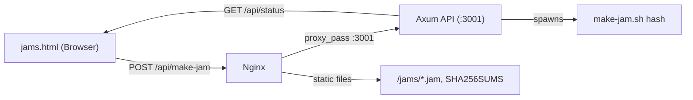

# Rust API Server + Nginx Reverse Proxy for [make-jam.sh](http://make-jam.sh)

## Architecture




## Framework Choice: Axum

Axum is the most ergonomic Rust web framework (closest to FastAPI's style), backed by the Tokio team. Minimal dependencies, clean handler signatures, built-in JSON support via serde.

## What Gets Created

### 1. Rust API project — `api/`

A new Cargo project at `api/` in the repo with these files:

- `**api/Cargo.toml**` — Dependencies: `axum`, `tokio`, `serde`, `serde_json`, `tower-http` (for CORS)
- `**api/src/main.rs**` — Axum server on `127.0.0.1:3001` with:
  - `POST /api/make-jam` — Validates `X-API-Key` header, spawns `make-jam.sh hash` as a child process, streams stdout/stderr, returns JSON result `{ "success": bool, "output": string }`
  - `GET /api/status` — Returns whether a job is currently running (prevents concurrent runs)
  - API key read from `API_KEY` env var at startup
  - Only one `make-jam.sh` execution at a time (guarded by an `Arc<Mutex<>>`)

### 2. Systemd service — `api/nockchain-jammer-api.service`

A unit file to run the Axum binary as a systemd service, configured with:

- `Environment=API_KEY=<placeholder>` (user replaces with real key)
- `Environment=HTML_ROOT=/usr/share/nginx/html`
- Runs as a user with sudo/permissions to execute `make-jam.sh` (which calls `systemctl stop/start`)
- `Restart=on-failure`

### 3. Nginx config snippet — `api/nginx-api.conf`

A location block to add to the existing nginx server block:

```nginx
location /api/ {
    proxy_pass http://127.0.0.1:3001;
    proxy_set_header Host $host;
    proxy_set_header X-Real-IP $remote_addr;
    proxy_read_timeout 120s;
}
```

### 4. Updated `jams.html`

Add a "Run make-jam" button + a modal/section that:

- Prompts for the API key (stored in `localStorage` for convenience)
- POSTs to `/api/make-jam` with `X-API-Key` header
- Shows a spinner while running, then displays the script output
- Has a "Check Status" indicator that polls `GET /api/status`

## Security Model

- API key checked server-side in the Axum handler — returns 401 if missing/wrong
- Axum binds to `127.0.0.1` only — not reachable from the internet directly
- Nginx proxies `/api/` to the local Axum server
- Rate limiting can be added later via nginx `limit_req`

## Deployment Steps (documented in a README section)

1. `cd api && cargo build --release`
2. Copy binary to server
3. Install systemd service, set real `API_KEY`
4. Add nginx location block, `nginx -t && systemctl reload nginx`
5. Deploy updated `jams.html`

